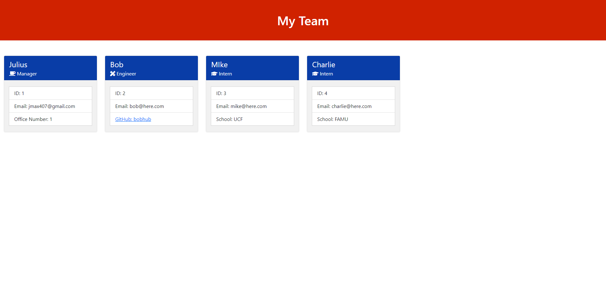

# Team Profile Generator  
  

# Screenshot

# Description
Generate a webpage that displays my team's basic info

# Table of Contents
*[Demo](#demo)  
*[Technology](#technology)  
*[Features](#features)  
*[Installation](#installation)  
*[Usage](#usage)  
*[Contribute](#contribute)  
*[Tests](#tests)  
*[Questions](#questions)  
*[License](#license)

# Demo
[DEMO: Team Profile Generator](https://drive.google.com/file/d/1MdziulBjsKwR5z9GS7FvzvXR9CXL88Kw/view)

# Technology 
| Technology | Description                        |Links ↘️ |
| ---------- | -----------------------------------| ------|  
|  | HTML CSS Javascript | [n/a](n/a) |

# Features
insert info in prompt to generate html content

# Installation  
Project Repository: [Team Profile Generator](https://github.com/jmax407/team-profile-generator)  
npm install inquirer 

# Usage
[Team Profile Generator](https://jmax407.github.io/team-profile-generator/)  
answer the prompt questions

# Contribute 
n/a

# Tests
npm run test

# Questions
Feel free to reach out if you have any questions

Contact via GitHub: [jmax407](https://github.com/jmax407)  
Send an email: [jmax407@gmail.com](mailto:jmax407@gmail.com)

# License
None
